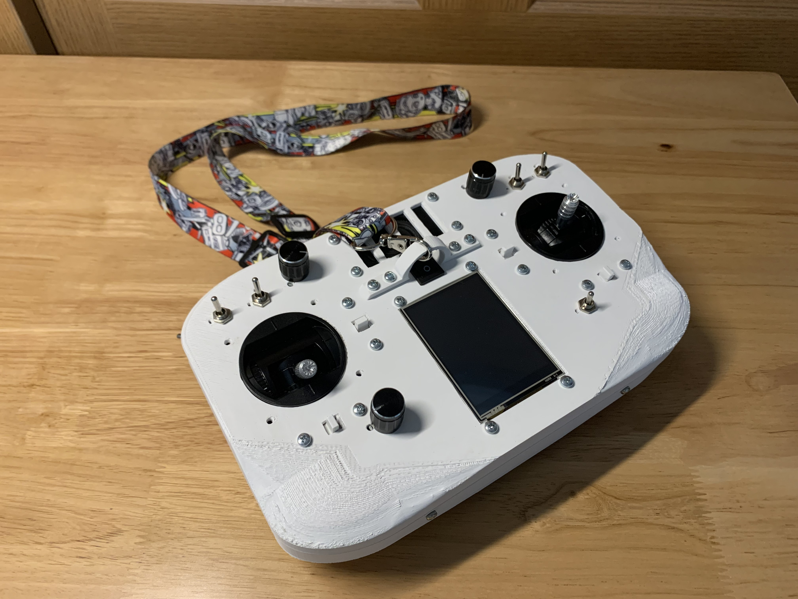
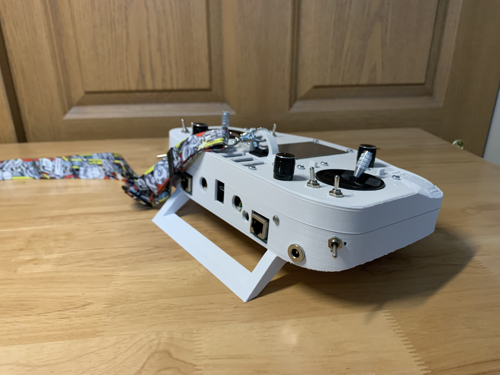
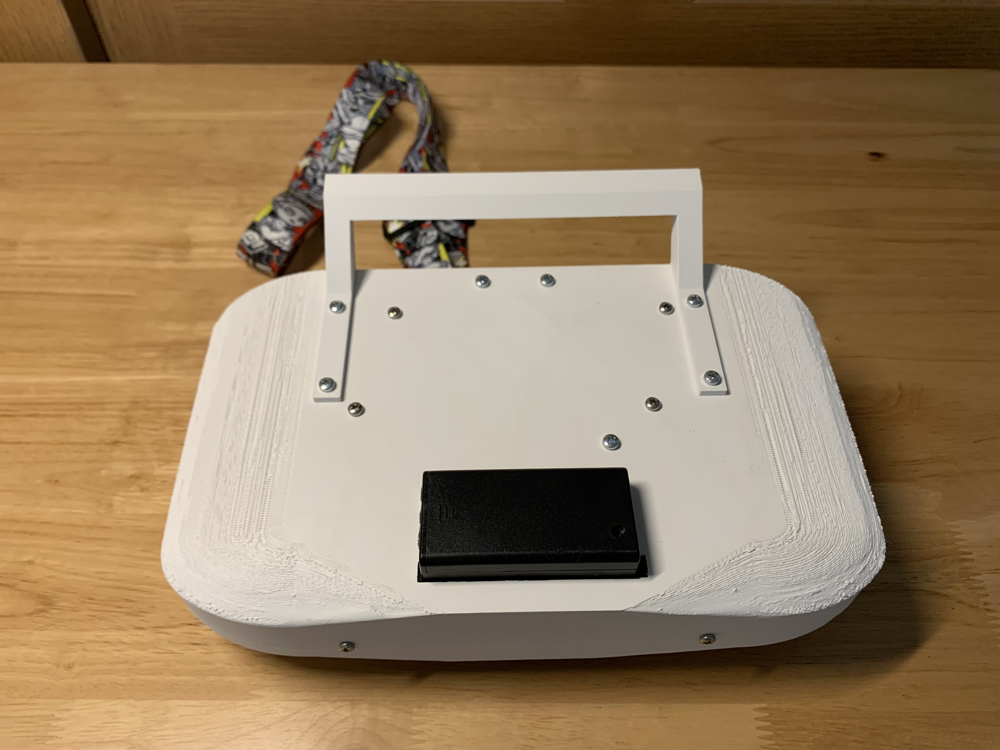
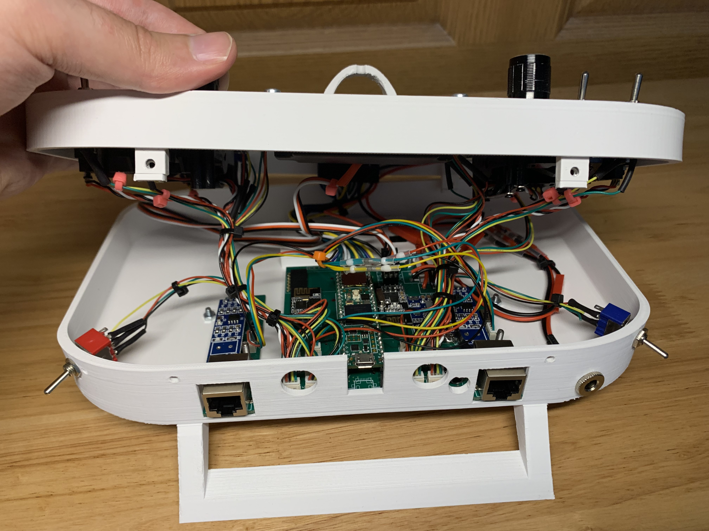
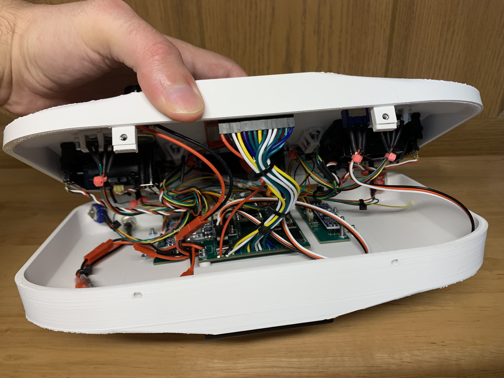
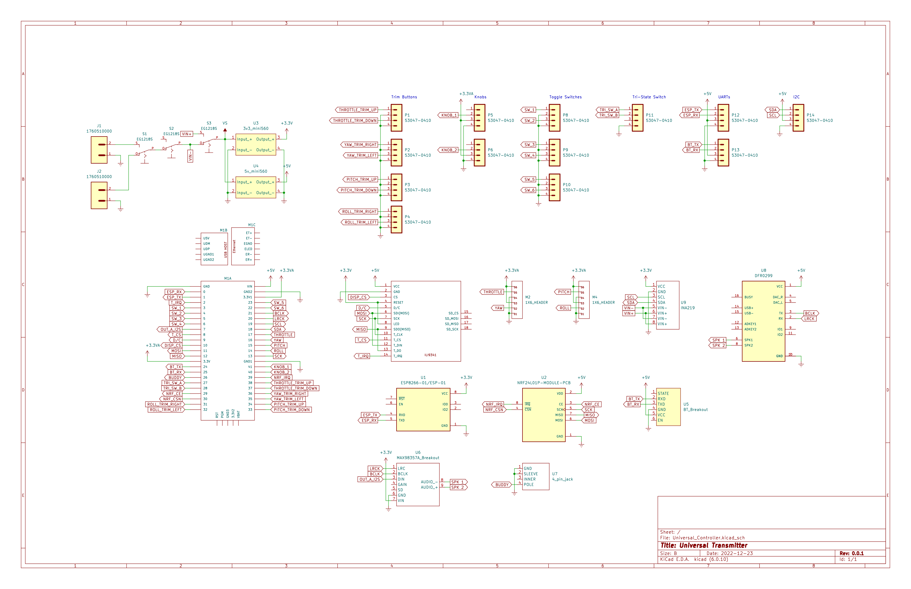
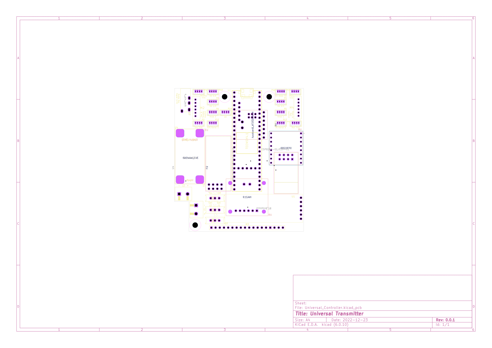
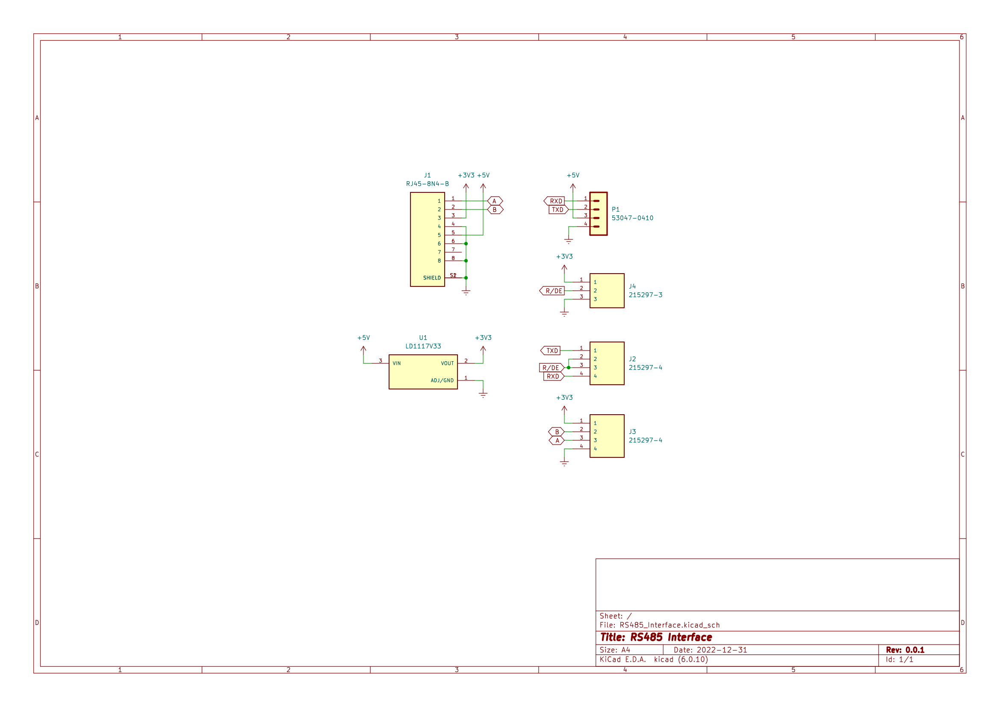
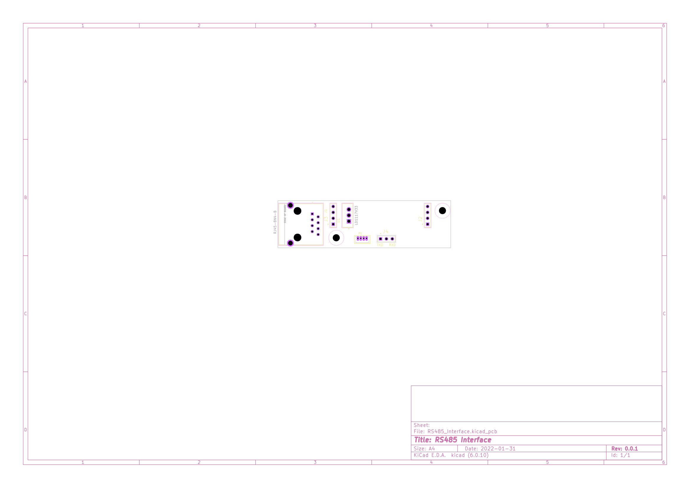

# UniversalTransmitter

This is an open-source, Arduino-based handheld transmitter. This handheld transmitter can be used in any robotics application that requires user input (i.e., RC car, RC airplane, robotic arm, etc.) and includes the following features:

- Teensy 4.1 microcontroller
- [2.8" TFT touchscreen](https://www.amazon.com/gp/product/B09XHJ9KRX/ref=ppx_yo_dt_b_search_asin_title?ie=UTF8&psc=1)
- Lanyard clip
- 1 [3.5mm buddy box signal jack](https://www.amazon.com/gp/product/B07KY8NMD5/ref=ppx_yo_dt_b_search_asin_title?ie=UTF8&psc=1)
  - Only tested with a Flysky FS-i6X
- 2 [RC joystick gimbals](https://www.amazon.com/gp/product/B07YCYNBWF/ref=ppx_yo_dt_b_search_asin_title?ie=UTF8&psc=1)
- 8 [4.3mm Joystick trim buttons](https://www.amazon.com/gp/product/B00R17XUFC/ref=ppx_yo_dt_b_search_asin_title?ie=UTF8&psc=1)
- 2 [general analog knobs](https://www.amazon.com/gp/product/B07B64MWRF/ref=ppx_yo_dt_b_search_asin_title?ie=UTF8&psc=1)
- 5 [toggle switches](https://www.amazon.com/gp/product/B079JBF815/ref=ppx_yo_dt_b_search_asin_title?ie=UTF8&psc=1)
- 1 [tri-state switch](https://www.amazon.com/gp/product/B07QC6T4GW/ref=ppx_yo_dt_b_search_asin_title?ie=UTF8&psc=1)
- 1 [speaker](https://www.amazon.com/gp/product/B0738NLFTG/ref=ppx_yo_dt_b_search_asin_title?ie=UTF8&psc=1)
  - Can be controlled with a DFPlayerMini or I2S
  - 1 [volume knob](https://www.amazon.com/gp/product/B07B64MWRF/ref=ppx_yo_dt_b_search_asin_title?ie=UTF8&psc=1)
- 2 power supplies
  - Can use battery pack or external power via [5.5mm barrel jack](https://www.amazon.com/gp/product/B08SJM2G52/ref=ppx_yo_dt_b_search_asin_title?ie=UTF8&psc=1)
  - 1 [power supply select switch](https://www.amazon.com/gp/product/B079JBF815/ref=ppx_yo_dt_b_search_asin_title?ie=UTF8&psc=1)
- 1 [ESP8266 ESP-01S WiFi module](https://www.amazon.com/gp/product/B09J2KPHTN/ref=ppx_yo_dt_b_search_asin_title?ie=UTF8&psc=1)
- 1 [NRF24L01+ 2.4GHz RF module](https://www.amazon.com/gp/product/B00LX47OCY/ref=ppx_yo_dt_b_search_asin_title?ie=UTF8&psc=1)
- 1 [BLE](https://www.amazon.com/gp/product/B01N4P7T0H/ref=ox_sc_saved_title_8?smid=&psc=1) or [classic BT module slot](https://www.amazon.com/gp/product/B07VL725T8/ref=ppx_yo_dt_b_search_asin_title?ie=UTF8&psc=1)
- [RS485](https://www.amazon.com/gp/product/B00NIOLNAG/ref=ppx_yo_dt_b_search_asin_title?ie=UTF8&psc=1) external interface via 2 [RJ45 jacks](https://www.amazon.com/gp/product/B09MBP7ZLR/ref=ppx_yo_dt_b_search_asin_title?ie=UTF8&psc=1)
  - Can use this to communicate with external serial radios (i.e., RFD900+ modules)
- Channel mixing
- Channel expo
- Channel reversing

For software examples, there is a sketch for testing basic functionality of the various features found at `.\examples\example`. Additionally, there is a much more complex sketch with advanced software and configuration features found at `.\examples\complex_example`.

Also, the case is 3D printed (ABS or ASA filament preferred). The 3D parts can be found in the `.\extras\print_files` folder. If you want to easily remix any of the pieces, you can use a copy of the original Blend file found at `.\extras\Universal_Transmitter.blend`.

Lastly, the PCBs can be made using the gerber files found at `.\extras\gerber_files`.

